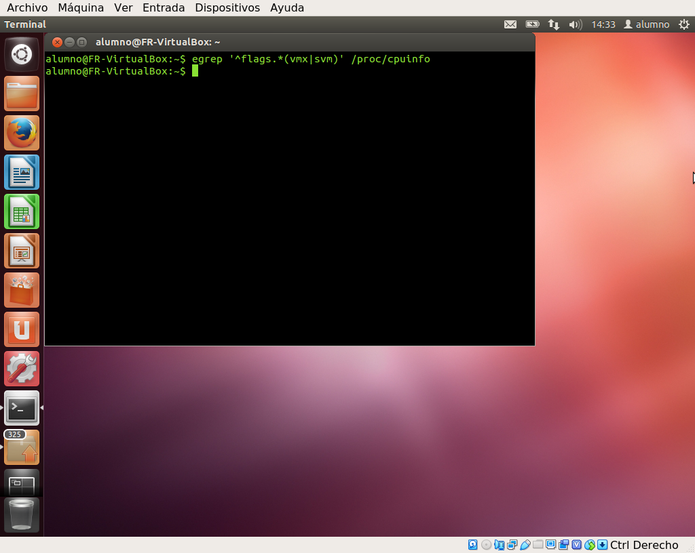

# Tema 1: Introducción a la infraestructura virtual: concepto y soporte físico

## Ejercicio 1

1. **Consultar en el catálogo de alguna tienda de informática el precio de un
ordenador tipo servidor y calcular su coste de amortización a cuatro y siete
años. Consultar [este artículo en Infoautónomos sobre el tema](https://infoautonomos.eleconomista.es/consultas-a-la-comunidad/988/).**

## Ejercicio 2

1. **Usando las tablas de precios de servicios de alojamiento en Internet “clásicos”,
es decir, que ofrezcan *Virtual Private Servers* o servidores físicos, y de proveedores
de servicios en la nube, comparar el coste durante un año de un ordenador con un
procesador estándar (escogerlo de forma que sea el mismo tipo de procesador en los
dos vendedores) y con el resto de las características similares (tamaño de disco
duro equivalente a transferencia de disco duro) en el caso de que la infraestructura
comprada se usa solo el 1% o el 10% del tiempo.**

## Ejercicio 3

1. **En general, cualquier ordenador con menos de 5 o 6 años tendrá estos *flags*.
¿Qué modelo de procesador es? ¿Qué aparece como salida de esa orden? Si usas una
máquina virtual, ¿qué resultado da? ¿Y en una Raspberry Pi o, si tienes acceso,
[el procesador del móvil](https://stackoverflow.com/questions/26239956/how-to-get-specific-information-of-an-android-device-from-proc-cpuinfo-file)?**

El procesador de mi portátil es un Intel i7-7700. Esto lo he obtenido utilizando el
siguiente comando:

```bash
lscpu
```

La salida que me ha ofrecido es:

```
Arquitectura:                        x86_64
modo(s) de operación de las CPUs:    32-bit, 64-bit
Orden de los bytes:                  Little Endian
CPU(s):                              8
Lista de la(s) CPU(s) en línea:      0-7
Hilo(s) de procesamiento por núcleo: 2
Núcleo(s) por «socket»:              4
«Socket(s)»                          1
Modo(s) NUMA:                        1
ID de fabricante:                    GenuineIntel
Familia de CPU:                      6
Modelo:                              158
Nombre del modelo:                   Intel(R) Core(TM) i7-7700HQ CPU @ 2.80GHz
Revisión:                            9
CPU MHz:                             1338.074
CPU MHz máx.:                        3800,0000
CPU MHz mín.:                        800,0000
BogoMIPS:                            5616.00
Virtualización:                      VT-x
Caché L1d:                           32K
Caché L1i:                           32K
Caché L2:                            256K
Caché L3:                            6144K
CPU(s) del nodo NUMA 0:              0-7
Indicadores:                         fpu vme de pse tsc msr pae mce cx8 apic sep mtrr pge mca cmov pat pse36 clflush dts acpi mmx fxsr sse sse2 ss ht tm pbe syscall nx pdpe1gb rdtscp lm constant_tsc art arch_perfmon pebs bts rep_good nopl xtopology nonstop_tsc cpuid aperfmperf tsc_known_freq pni pclmulqdq dtes64 monitor ds_cpl vmx est tm2 ssse3 sdbg fma cx16 xtpr pdcm pcid sse4_1 sse4_2 x2apic movbe popcnt tsc_deadline_timer aes xsave avx f16c rdrand lahf_lm abm 3dnowprefetch cpuid_fault epb invpcid_single pti ssbd ibrs ibpb stibp tpr_shadow vnmi flexpriority ept vpid fsgsbase tsc_adjust bmi1 avx2 smep bmi2 erms invpcid mpx rdseed adx smap clflushopt intel_pt xsaveopt xsavec xgetbv1 xsaves dtherm ida arat pln pts hwp hwp_notify hwp_act_window hwp_epp md_clear flush_l1d
```

Para ver qué *flags* tiene activados el procesador, he utilizado la orden:

```bash
egrep '^flags.*(vmx|svm)' /proc/cpuinfo
```

La salida que me ha dado la orden es la siguiente:

```
flags		: fpu vme de pse tsc msr pae mce cx8 apic sep mtrr pge mca cmov pat pse36 clflush dts acpi mmx fxsr sse sse2 ss ht tm pbe syscall nx pdpe1gb rdtscp lm constant_tsc art arch_perfmon pebs bts rep_good nopl xtopology nonstop_tsc cpuid aperfmperf tsc_known_freq pni pclmulqdq dtes64 monitor ds_cpl vmx est tm2 ssse3 sdbg fma cx16 xtpr pdcm pcid sse4_1 sse4_2 x2apic movbe popcnt tsc_deadline_timer aes xsave avx f16c rdrand lahf_lm abm 3dnowprefetch cpuid_fault epb invpcid_single pti ssbd ibrs ibpb stibp tpr_shadow vnmi flexpriority ept vpid fsgsbase tsc_adjust bmi1 avx2 smep bmi2 erms invpcid mpx rdseed adx smap clflushopt intel_pt xsaveopt xsavec xgetbv1 xsaves dtherm ida arat pln pts hwp hwp_notify hwp_act_window hwp_epp md_clear flush_l1d
flags		: fpu vme de pse tsc msr pae mce cx8 apic sep mtrr pge mca cmov pat pse36 clflush dts acpi mmx fxsr sse sse2 ss ht tm pbe syscall nx pdpe1gb rdtscp lm constant_tsc art arch_perfmon pebs bts rep_good nopl xtopology nonstop_tsc cpuid aperfmperf tsc_known_freq pni pclmulqdq dtes64 monitor ds_cpl vmx est tm2 ssse3 sdbg fma cx16 xtpr pdcm pcid sse4_1 sse4_2 x2apic movbe popcnt tsc_deadline_timer aes xsave avx f16c rdrand lahf_lm abm 3dnowprefetch cpuid_fault epb invpcid_single pti ssbd ibrs ibpb stibp tpr_shadow vnmi flexpriority ept vpid fsgsbase tsc_adjust bmi1 avx2 smep bmi2 erms invpcid mpx rdseed adx smap clflushopt intel_pt xsaveopt xsavec xgetbv1 xsaves dtherm ida arat pln pts hwp hwp_notify hwp_act_window hwp_epp md_clear flush_l1d
flags		: fpu vme de pse tsc msr pae mce cx8 apic sep mtrr pge mca cmov pat pse36 clflush dts acpi mmx fxsr sse sse2 ss ht tm pbe syscall nx pdpe1gb rdtscp lm constant_tsc art arch_perfmon pebs bts rep_good nopl xtopology nonstop_tsc cpuid aperfmperf tsc_known_freq pni pclmulqdq dtes64 monitor ds_cpl vmx est tm2 ssse3 sdbg fma cx16 xtpr pdcm pcid sse4_1 sse4_2 x2apic movbe popcnt tsc_deadline_timer aes xsave avx f16c rdrand lahf_lm abm 3dnowprefetch cpuid_fault epb invpcid_single pti ssbd ibrs ibpb stibp tpr_shadow vnmi flexpriority ept vpid fsgsbase tsc_adjust bmi1 avx2 smep bmi2 erms invpcid mpx rdseed adx smap clflushopt intel_pt xsaveopt xsavec xgetbv1 xsaves dtherm ida arat pln pts hwp hwp_notify hwp_act_window hwp_epp md_clear flush_l1d
flags		: fpu vme de pse tsc msr pae mce cx8 apic sep mtrr pge mca cmov pat pse36 clflush dts acpi mmx fxsr sse sse2 ss ht tm pbe syscall nx pdpe1gb rdtscp lm constant_tsc art arch_perfmon pebs bts rep_good nopl xtopology nonstop_tsc cpuid aperfmperf tsc_known_freq pni pclmulqdq dtes64 monitor ds_cpl vmx est tm2 ssse3 sdbg fma cx16 xtpr pdcm pcid sse4_1 sse4_2 x2apic movbe popcnt tsc_deadline_timer aes xsave avx f16c rdrand lahf_lm abm 3dnowprefetch cpuid_fault epb invpcid_single pti ssbd ibrs ibpb stibp tpr_shadow vnmi flexpriority ept vpid fsgsbase tsc_adjust bmi1 avx2 smep bmi2 erms invpcid mpx rdseed adx smap clflushopt intel_pt xsaveopt xsavec xgetbv1 xsaves dtherm ida arat pln pts hwp hwp_notify hwp_act_window hwp_epp md_clear flush_l1d
flags		: fpu vme de pse tsc msr pae mce cx8 apic sep mtrr pge mca cmov pat pse36 clflush dts acpi mmx fxsr sse sse2 ss ht tm pbe syscall nx pdpe1gb rdtscp lm constant_tsc art arch_perfmon pebs bts rep_good nopl xtopology nonstop_tsc cpuid aperfmperf tsc_known_freq pni pclmulqdq dtes64 monitor ds_cpl vmx est tm2 ssse3 sdbg fma cx16 xtpr pdcm pcid sse4_1 sse4_2 x2apic movbe popcnt tsc_deadline_timer aes xsave avx f16c rdrand lahf_lm abm 3dnowprefetch cpuid_fault epb invpcid_single pti ssbd ibrs ibpb stibp tpr_shadow vnmi flexpriority ept vpid fsgsbase tsc_adjust bmi1 avx2 smep bmi2 erms invpcid mpx rdseed adx smap clflushopt intel_pt xsaveopt xsavec xgetbv1 xsaves dtherm ida arat pln pts hwp hwp_notify hwp_act_window hwp_epp md_clear flush_l1d
flags		: fpu vme de pse tsc msr pae mce cx8 apic sep mtrr pge mca cmov pat pse36 clflush dts acpi mmx fxsr sse sse2 ss ht tm pbe syscall nx pdpe1gb rdtscp lm constant_tsc art arch_perfmon pebs bts rep_good nopl xtopology nonstop_tsc cpuid aperfmperf tsc_known_freq pni pclmulqdq dtes64 monitor ds_cpl vmx est tm2 ssse3 sdbg fma cx16 xtpr pdcm pcid sse4_1 sse4_2 x2apic movbe popcnt tsc_deadline_timer aes xsave avx f16c rdrand lahf_lm abm 3dnowprefetch cpuid_fault epb invpcid_single pti ssbd ibrs ibpb stibp tpr_shadow vnmi flexpriority ept vpid fsgsbase tsc_adjust bmi1 avx2 smep bmi2 erms invpcid mpx rdseed adx smap clflushopt intel_pt xsaveopt xsavec xgetbv1 xsaves dtherm ida arat pln pts hwp hwp_notify hwp_act_window hwp_epp md_clear flush_l1d
flags		: fpu vme de pse tsc msr pae mce cx8 apic sep mtrr pge mca cmov pat pse36 clflush dts acpi mmx fxsr sse sse2 ss ht tm pbe syscall nx pdpe1gb rdtscp lm constant_tsc art arch_perfmon pebs bts rep_good nopl xtopology nonstop_tsc cpuid aperfmperf tsc_known_freq pni pclmulqdq dtes64 monitor ds_cpl vmx est tm2 ssse3 sdbg fma cx16 xtpr pdcm pcid sse4_1 sse4_2 x2apic movbe popcnt tsc_deadline_timer aes xsave avx f16c rdrand lahf_lm abm 3dnowprefetch cpuid_fault epb invpcid_single pti ssbd ibrs ibpb stibp tpr_shadow vnmi flexpriority ept vpid fsgsbase tsc_adjust bmi1 avx2 smep bmi2 erms invpcid mpx rdseed adx smap clflushopt intel_pt xsaveopt xsavec xgetbv1 xsaves dtherm ida arat pln pts hwp hwp_notify hwp_act_window hwp_epp md_clear flush_l1d
flags		: fpu vme de pse tsc msr pae mce cx8 apic sep mtrr pge mca cmov pat pse36 clflush dts acpi mmx fxsr sse sse2 ss ht tm pbe syscall nx pdpe1gb rdtscp lm constant_tsc art arch_perfmon pebs bts rep_good nopl xtopology nonstop_tsc cpuid aperfmperf tsc_known_freq pni pclmulqdq dtes64 monitor ds_cpl vmx est tm2 ssse3 sdbg fma cx16 xtpr pdcm pcid sse4_1 sse4_2 x2apic movbe popcnt tsc_deadline_timer aes xsave avx f16c rdrand lahf_lm abm 3dnowprefetch cpuid_fault epb invpcid_single pti ssbd ibrs ibpb stibp tpr_shadow vnmi flexpriority ept vpid fsgsbase tsc_adjust bmi1 avx2 smep bmi2 erms invpcid mpx rdseed adx smap clflushopt intel_pt xsaveopt xsavec xgetbv1 xsaves dtherm ida arat pln pts hwp hwp_notify hwp_act_window hwp_epp md_clear flush_l1d
```

Como se puede ver, mi procesador es capaz de ofrecer virtualización, ya que el *flag* ```vmx```
se puede encontrar entre la lista de *flags*. Se puede ver además que se ofrece una línea de
salida por cada core lógico de la CPU.

He probado la orden en una máquina virtual que habíamos usado en la asignatura de Fundamentos
de Redes, la cuál tiene un Ubuntu 12.04. La salida que he obtenido ha sido:



Como se puede ver, no se dispone de tecnología de virtualización dentro de la máquina virtual,
ya que no aparece ningún *flag* que lo indique.

Al no disponer de unas Raspberry Pi, he tenido que recurrir a consultar la información sobre
la CPU de mi móvil (un OnePlus 6). La CPU que utiliza es Qualcomm SDM845 Snapdragon 845, el cuál
tiene 8 cores.

Para consultar la información, he ejecutado:

```bash
adb shell cat /proc/cpuinfo
```

La salida que he obtenido es:

```
Processor	: AArch64 Processor rev 12 (aarch64)
processor	: 0
BogoMIPS	: 38.40
Features	: fp asimd evtstrm aes pmull sha1 sha2 crc32 atomics fphp asimdhp
CPU implementer	: 0x51
CPU architecture: 8
CPU variant	: 0x7
CPU part	: 0x803
CPU revision	: 12

processor	: 1
BogoMIPS	: 38.40
Features	: fp asimd evtstrm aes pmull sha1 sha2 crc32 atomics fphp asimdhp
CPU implementer	: 0x51
CPU architecture: 8
CPU variant	: 0x7
CPU part	: 0x803
CPU revision	: 12

processor	: 2
BogoMIPS	: 38.40
Features	: fp asimd evtstrm aes pmull sha1 sha2 crc32 atomics fphp asimdhp
CPU implementer	: 0x51
CPU architecture: 8
CPU variant	: 0x7
CPU part	: 0x803
CPU revision	: 12

processor	: 3
BogoMIPS	: 38.40
Features	: fp asimd evtstrm aes pmull sha1 sha2 crc32 atomics fphp asimdhp
CPU implementer	: 0x51
CPU architecture: 8
CPU variant	: 0x7
CPU part	: 0x803
CPU revision	: 12

processor	: 4
BogoMIPS	: 38.40
Features	: fp asimd evtstrm aes pmull sha1 sha2 crc32 atomics fphp asimdhp
CPU implementer	: 0x51
CPU architecture: 8
CPU variant	: 0x6
CPU part	: 0x802
CPU revision	: 13

processor	: 5
BogoMIPS	: 38.40
Features	: fp asimd evtstrm aes pmull sha1 sha2 crc32 atomics fphp asimdhp
CPU implementer	: 0x51
CPU architecture: 8
CPU variant	: 0x6
CPU part	: 0x802
CPU revision	: 13

processor	: 6
BogoMIPS	: 38.40
Features	: fp asimd evtstrm aes pmull sha1 sha2 crc32 atomics fphp asimdhp
CPU implementer	: 0x51
CPU architecture: 8
CPU variant	: 0x6
CPU part	: 0x802
CPU revision	: 13

processor	: 7
BogoMIPS	: 38.40
Features	: fp asimd evtstrm aes pmull sha1 sha2 crc32 atomics fphp asimdhp
CPU implementer	: 0x51
CPU architecture: 8
CPU variant	: 0x6
CPU part	: 0x802
CPU revision	: 13
```

La información de los *flags* se puede consultar [aquí](https://en.wikichip.org/wiki/arm/armv8).
Al ser un procesador basado en ARM, y además al estar en un dispositivo móvil, éste no
dispone de tecnología de virtualización. Esto se debe a que posiblemente la virtualización
sea demasiado costosa en un teléfono móvil, teniendo en cuenta las limitadas capacidades
de CPU y batería que tienen éstos, y que por tanto, supondría demasiada carga para
el dispositivo.

## Ejercicio 4

1. **Comprobar si el núcleo instalado en tu ordenador contiene este módulo del
kernel usando la orden ```kvm-ok```. Alternativamente (o además), usar ```lscpu```
como se indica arriba.**
2. **Instalar un hipervisor para gestionar máquinas virtuales, que más adelante
se podrá usar en pruebas y ejercicios.**

## Ejercicio 5

1. **Darse de alta en servicios de nube usando ofertas gratuitas o cupones que
pueda proporcionar el profesor.**

## Ejercicio 6

1. **Darse de alta en una web que permita hacer pruebas con alguno de los
sistemas de gestión de nube anteriores.**
